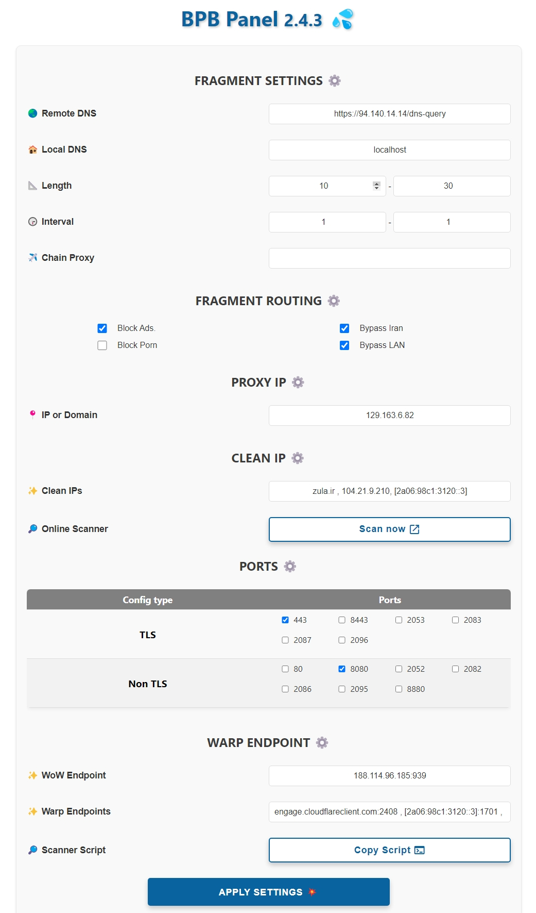

<h1 align=“center”>💦 BPB面板</h1>

### 🌏 [波斯语](README_fa.md) [English](README.md)

  

 

介绍
该项目致力于为开发用户面板[Cloudflare workers/pages代理脚本](https://github.com/yonggekkk/Cloudflare-workers-pages-vless)由[yong gekkk](https://github.com/yonggekkk)创建. 该面板提供了两个部署选项：
- **Cloudflare Worker**部署
- **Pages**部署
 

## 特点

1. **免费**：不涉及任何费用。
2. **用户友好面板：** 设计用于方便导航、配置和使用。
3. **支持片段：** 提供对片段功能的支持。
4. **屏蔽广告和色情（可选）**
5. **绕过伊朗和局域网（可选）**
6. **完整的路由规则：** 绕过伊朗，屏蔽广告，恶意软件，网络钓鱼。。。用于`Sing-Box`。
7. **链代理：** 可以添加一个`Chain Proxy`来修复IP。
8. **支持广泛的客户端：** 为`Xray`和单盒核心客户端提供订阅链接。
9. **订阅链接（JSON）：** 为JSON配置提供订阅链接。
10. **密码保护面板：** 使用密码保护保护面板。
11. **自定义Cloudflare Clean IP:** 能够使用在线扫描仪并设置干净的IP域。
12. **Warp配置：** 提供`Warp`和`Warp on Warp`订阅。
 

## 如何使用：
- [安装（Pages）](docs/Pages_Installation_fa.md)

- [安装（Worker）](docs/Worker_Installation_fa.md)

- [如何使用](docs/configuration_fa.md)

- [常见问题解答](docs/FAQ.md)
 

## 支持的客户端
|客户端|版本|是否可用|
| :-------------: | :-------------: | :-------------: |
| **v2rayNG**  | 1.8.19 or higher  | :heavy_check_mark: |
| **v2rayN**  | 6.42 or higher  | :heavy_check_mark: |
| **Nekobox**  |   | :x: |
| **Sing-box**  | 1.8.10 or higher  | :x: |
| **Streisand**  |   | :heavy_check_mark: |
| **V2Box**  |   | :x: |
| **Shadowrocket**  |   | :x: |
| **Nekoray**  |   | :heavy_check_mark: |
| **Hiddify**  |   | :x: |

---

---

### 特别感谢
- CF vless代码作者[3Kmfi6HP](https://github.com/3Kmfi6HP/EDtunnel)
- CF 首选IP程序作者[badafans](https://github.com/badafans/Cloudflare-IP-SpeedTest)，[XIU2](https://github.com/XIU2/CloudflareSpeedTest)
- [BPB Worker Panel](https://github.com/bia-pain-bache/BPB-Worker-Panel)官方版

---
